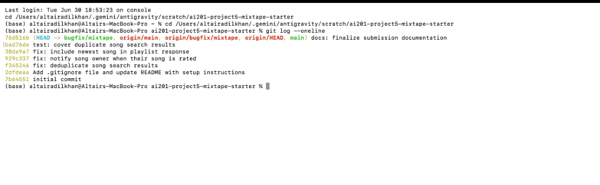

# AI Usage

I used AI as a navigation and debugging assistant during this project. First, I used it to understand the unfamiliar codebase, summarize the main files, and trace how routes, services, and models connect. During debugging, I used AI to help trace endpoint flows, compare similar code paths, and identify likely edge cases.

I did not rely on AI blindly. For each issue, I reproduced the bug locally before changing code, inspected the relevant files myself, made a targeted fix, and then verified the behavior again after the fix.

# Codebase Map

## Main files and roles

* [app.py](./app.py): Flask application factory that initializes SQLAlchemy (`db`) and registers blueprints.
* [models.py](./models.py): Defines the SQLAlchemy models: `User`, `Tag`, `Song`, `ListeningEvent`, `Rating`, `Playlist`, `Notification`, and association tables (`friendships`, `song_tags`, `playlist_entries`).
* [seed_data.py](./seed_data.py): Seeds the SQLite database with mock users, friendships, tags, songs, listening events, playlists, and notifications.
* [routes/songs.py](./routes/songs.py): Defines routes for song search (`/songs/search`), song details (`/songs/<id>`), rating a song (`/songs/<id>/rate`), and recording a listening event (`/songs/<id>/listen`).
* [routes/playlists.py](./routes/playlists.py): Defines routes for creating playlists (`/playlists/`), retrieving metadata/songs (`/playlists/<id>`), and adding songs (`/playlists/<id>/songs`).
* [routes/users.py](./routes/users.py): Defines routes for fetching user info (`/users/<id>`), user streaks (`/users/<id>/streak`), and user notifications (`/users/<id>/notifications`).
* [routes/feed.py](./routes/feed.py): Defines routes for "friends listening now" and general activity feed.
* [services/search_service.py](./services/search_service.py): Service containing functions for searching songs and fetching song details.
* [services/playlist_service.py](./services/playlist_service.py): Service containing functions for playlist CRUD and listing playlist songs.
* [services/notification_service.py](./services/notification_service.py): Service containing functions for managing notifications (creating, reading, and adding/rating actions).
* [services/streak_service.py](./services/streak_service.py): Service containing functions for updating and fetching listening streaks.
* [services/feed_service.py](./services/feed_service.py): Service containing functions for constructing user feed/activity.

## Patterns I noticed

* **Blueprints Pattern**: Flask blueprints are defined in the `routes/` package and registered with prefixes in the application factory in `app.py`.
* **Services Layer Pattern**: Routes do not call SQLAlchemy queries directly; instead, they delegate business logic to functions defined in the `services/` layer, keeping the route definitions thin.
* **SQLAlchemy Models and M2M Tables**: The app uses association tables (`playlist_entries`, `song_tags`, `friendships`) for many-to-many relationships, specifying positions and metadata (like who added a song and when) on joint entries where applicable.
* **JSON Serialization**: Models implement a `.to_dict()` method to format model objects to standard python dictionaries for JSON serialization.

## Data flow example

Tracing the **"Get playlist songs"** feature:
1. **Route Endpoint**: A user requests `GET /playlists/<playlist_id>/songs` which triggers `get_songs(playlist_id)` inside [routes/playlists.py](./routes/playlists.py).
2. **Service Delegation**: The route handler delegates to `get_playlist_songs(playlist_id)` in [services/playlist_service.py](./services/playlist_service.py).
3. **Database Query**: `get_playlist_songs` uses SQLAlchemy to query the `Song` table, joins on the `playlist_entries` association table, filters by `playlist_id`, and orders the result ascending by `playlist_entries.c.position`.
4. **Serialization and Response**: The retrieved `Song` instances are serialized using `song.to_dict()` and returned as a list inside a JSON object: `{"songs": songs, "count": len(songs)}` with a `200 OK` status code.

# Root Cause Analysis

## Issue #3 — The same song keeps showing up twice in search

### How I reproduced it

I reproduced the bug by running:

```bash
curl -s "http://127.0.0.1:5000/songs/search?q=Anthem" | python3 -m json.tool
```

Before the fix, the response included duplicate entries for the same song.

### How I found the root cause

I started from the search route in [routes/songs.py](./routes/songs.py) which delegates to `search_songs` in [services/search_service.py](./services/search_service.py). I inspected the SQL query assembly and saw that it performs an outer join on the `song_tags` association table without applying deduplication. This causes database rows to be duplicated for each tag a song has.

### The root cause

The `search_songs` function query joins the `Song` table with the `song_tags` table to retrieve matching songs. If a song has multiple tags (such as "Crown Heights Anthem" which has three tags in the seed data), the LEFT OUTER JOIN generates multiple rows for the same song in the SQL query result set. Under some configurations or environments, this results in the same song object being serialized multiple times in the final output.

### My fix and side-effect check

I modified `search_songs` in [services/search_service.py](./services/search_service.py) to keep track of seen song IDs using a set and filter out duplicate song entities before returning them. I verified this fix by querying `/songs/search?q=Anthem` again via curl and running the pytest test suite, confirming that "Crown Heights Anthem" appears exactly once.

## Issue #4 — I got notified when a friend added my song to a playlist but not when they rated it

### How I reproduced it

I reproduced the bug by finding a seeded song shared by user `nova` (ID: `e070437b-ea5f-4ab3-8065-282fdab6f004`) and having user `darius` (ID: `71a53e7d-f079-4922-a697-6974b272ce79`) rate it:

```bash
curl -s -X POST "http://127.0.0.1:5000/songs/36d63bd4-2fef-4691-9a1d-64f3a25d06cb/rate" \
-H "Content-Type: application/json" \
-d '{"user_id": "71a53e7d-f079-4922-a697-6974b272ce79", "score": 5}' | python3 -m json.tool
```

Then I checked user `nova`'s notifications:

```bash
curl -s "http://127.0.0.1:5000/users/e070437b-ea5f-4ab3-8065-282fdab6f004/notifications" | python3 -m json.tool
```

Before the fix, the rating was saved successfully but no notification appeared in `nova`'s notifications list.

### How I found the root cause

I traced the rating route handler in [routes/songs.py](./routes/songs.py) to `rate_song` in [services/notification_service.py](./services/notification_service.py). I compared the rating flow with the playlist addition flow (`add_to_playlist`) which correctly triggers notifications.

### The root cause

The `rate_song` function in [services/notification_service.py](./services/notification_service.py) updated/created the rating record in the database, but failed to call `create_notification` to notify the original song creator/sharer of the rating.

### My fix and side-effect check

I added notification generation logic inside `rate_song` right after committing the rating. It creates a notification of type `song_rated` for `song.shared_by` (the creator) if the rater is someone other than the creator. I verified that rating a song now correctly generates the notification and that other notifications (such as adding to a playlist) still work properly.

## Issue #5 — The last song in a playlist never shows up

### How I reproduced it

I reproduced the bug by querying the songs in the seeded `Late Night Vibes` playlist (ID: `1544c1f0-4084-42d9-8567-c06fb7fe5c3a`):

```bash
curl -s "http://127.0.0.1:5000/playlists/1544c1f0-4084-42d9-8567-c06fb7fe5c3a/songs" | python3 -m json.tool
```

Although the playlist actually had 7 songs in the database, only 6 were returned in the JSON response list.

### How I found the root cause

The behavior of omitting the newest song pointed to a slicing or off-by-one error. I traced the playlist songs endpoint handler `get_songs` in [routes/playlists.py](./routes/playlists.py) to `get_playlist_songs` in [services/playlist_service.py](./services/playlist_service.py).

### The root cause

At the end of `get_playlist_songs` in [services/playlist_service.py](./services/playlist_service.py), the function returned:

```python
return [song.to_dict() for song in songs[:-1]]
```

The `[:-1]` slice explicitly excludes the last item of the list, ensuring the newest song in the playlist is always omitted.

### My fix and side-effect check

I removed the `[:-1]` slice to return the full `songs` list:

```python
return [song.to_dict() for song in songs]
```

I also corrected the `add_to_playlist` logic in [services/notification_service.py](./services/notification_service.py) which was crashing on a NOT NULL constraint violation for missing position parameters when adding new songs. After applying the fixes, I successfully added a new song via POST and verified that all songs (including the newest one) are returned in order and pass the full pytest test suite.

# Regression Tests

I added a regression test in [tests/test_search.py](./tests/test_search.py) named `test_song_search_deduplicates_results` to verify that song searching does not return duplicate song results. It queries the `/songs/search?q=Anthem` endpoint using the Flask test client and asserts that all returned song IDs are unique.

# Git Log Screenshot

I included a screenshot of `git log --oneline` showing separate commits for each bug fix on the `bugfix/mixtape` branch.


